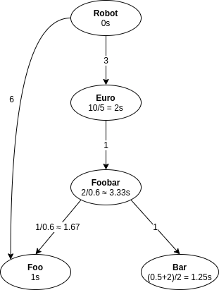

# Foobartory

# Goal

Instructions can be found [here](instructions.pdf).

## Running

You need the Java Runtime Environment (JRE) version 11 or above to run the application.

1. Download the application Jar file [here](https://github.com/msuret/foobartory/releases/latest/download/foobartory.jar)
2. Execute the Jar file:

```bash
java -jar foobartory.jar
```

## Output

The application outputs to the console all actions taken by the robots:

```text
INFO 0.00s      Robot #1 joined
INFO 0.00s      Robot #2 joined
INFO 0.00s      Robot #1 is moving from Robot shop to Foo Mine
INFO 0.00s      Robot #2 is moving from Robot shop to Bar Mine
INFO 10.00s     Robot #1 arrived to Foo Mine
INFO 10.00s     Robot #1 started working in Foo Mine
INFO 10.00s     Robot #2 arrived to Bar Mine
INFO 10.00s     Robot #2 started working in Bar Mine
INFO 11.00s     Robot #1 produced 1.0 FOO(s)
```

This is a bit tedious to read, so when the simulation ends a server is started showing various charts to sum up what
happened.

## Building

You need the Java Development Kit (JDK) version 11 or above to build the application.

Windows users must replace `./gradlew` by `gradlew.bat` in the commands below.

The commands are independant from each other and given in now particular order.

```shell
# Build the Jar File
./gradlew shadowJar

# Run tests
./gradlew test

# Launch the application
./gradlew run -q --console=plain
```

## Approach

The following terminology will be used in this section:

- **product**: either *foo*, *bar*, *foobar*, *euro* or *robot*
- **workstation**: place where the products are built (either *foo mine*, *bar mine*, *foobar factory*, *foobar point of
  sale*, or *robot shop*)
- **ingredients**: products consumed to build a product (e.g. *foo* and *bar* are the ingredients of *foobar*)

From the problem description we can build the following directed acyclic graph (DAG), where:

- nodes contain the average time needed to build one product
- edges contain the average amount of ingredients needed to build one product



From this we can easily compute the average amount of each product needed to get one robot, and the corresponding time
spent.

| Product | amount required | time required | % of time required |
| ------- | --------------- | ------------- | ------------------ |
| Robot   | 1               | 0s            | 0%                 |
| Euro    | 3               | 6s            | 19.51%             |
| Foobar  | 3               | 10s           | 32.52%             |
| Foo     | 11              | 11s           | 35.77%             |
| Bar     | 3               | 3.75s         | 12.20%             |

The last column gives us the ideal distribution of the robots over the workstations to minimize their time spent moving.

Of course, it is impossible to have this exact distribution especially in the beginning when the number of robots is
still small.

When a robot action is complete, the next one will be chosen according to the following (empirical) algorithm:

- if there are more robots in the current workstation than the target number and:
    - there are not enough ingredients to produce more in the workstation
    - or the workstation already produced enough to buy the next robot

  then the robot is reallocated to a workshop that has:
    - enough have ingredients to produce more
    - not yet produced enough to buy the next robot
- else if there is more than one additional robot in the workstation compared to the target number the robot is
  relocated to the workshop that is the furthest from its target number
- else make the robot work in the current workstation if there is enough ingredients
- else do nothing, and check the above conditions again when other robots complete their current action.

## TODOs

- Some operations with O(n) complexity in the number of robots are being computed each time the result is needed (like
  pending product amounts, or the number of robots in a workstation). This could be fixed with caching, but it is not
  worth the additional complexity for only 30 robots.
- Code coverage must be improved
- The charts show that there is more *Foo* produced than needed, the algorithm could be tweaked to avoid that